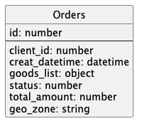
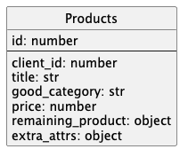
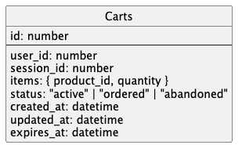

# Sharding 

## Orders collection
Коллекция заказов имеет вид:  
   
Будем использовать base on time шардирование. Оптимальный размер партиции — месячные.
1. В таких сервисах не нужно часто читать историю.
2. Дата создания уже есть в таблице. 
3. Шарды могут получаться не сбалансированы. 
Например, в чёрную пятницу партиция будет больше НО диски дешевые, а на процессоры можно автоскейл.
4. Лучшее кэш-попадание. Горячая партиция (текущий месяц) чаще помещается в памяти, не вытесняя холодные данные.
5. Дешёвая архивация и ретеншн. Старые данные можно просто DROP PARTITION / DETACH PARTITION вместо долгого DELETE — мгновенно освобождает место и не фрагментирует таблицу.
6. Быстрые выборки по диапазонам дат. Оптимизатор “отсекает” ненужные партиции (partition pruning), сканирует только нужные месяцы/дни → меньше I/O, быстрее SELECT ... WHERE order_date BETWEEN ....

## Products
Коллекция продуктов имеет вид:  
  
Будем использовать directory-based шардирование. 
1. Списывать остатки товара в гео зоне проще когда шардирование реализованно по гео принципу.
2. Остаток товара в большинстве случаев будет списывать внутри 1 гео зоны. 
Поэтому обращаться в несколько партиции придётся не часто. 

## Carts
